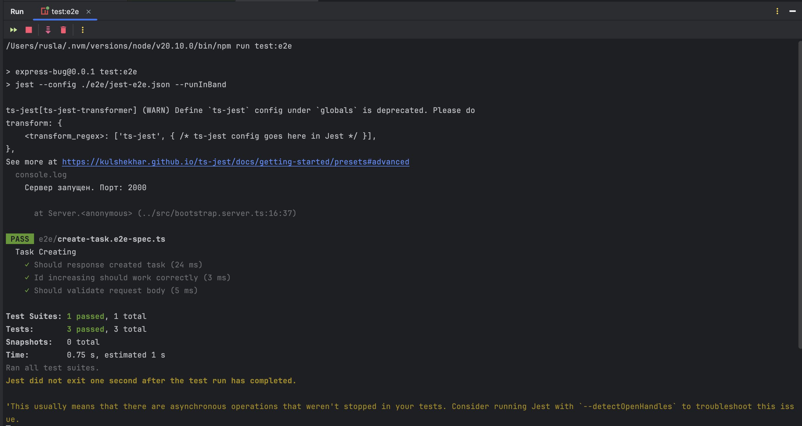

# Express-bug
Данные проект представляет собой Express-приложение с одним единственным методом - создание Task

## Тесты
Функционал создания Task покрыт `e2e` тестами с помощью `jest`.  
Сами тесты находятся в папке `e2e` и представляют собой `.ts` файлы  
А значит вы можете ставить Breakpoint'ы и заниматься отладкой (дебагом)
тестов и внутреннего сервера

### Запуск
Запустить тесты можно командой
```shell
npm run test:e2e
```

# Задание
На данный момент все 3 теста падают, вам необходимо исправить код, чтобы все тесты проходили успешно.  
**Вносить изменения в сами тесты запрещается!**  
Успешно завершающиеся тесты должны вывести такие логи - все 3 теста с зеленой галочкой.

